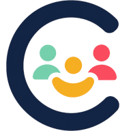
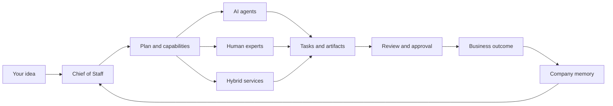

<div align="center">
  
  <h1>C-Sweet</h1>
  <p><strong>Your idea. Your company. Your workforce.</strong></p>
  <p>
    An open-source, self-hostable operating environment for agent-first companies.<br />
    Tell your Chief of Staff what you want to build; C-Sweet helps turn that intent into a company that can plan, staff, execute, and improve.
  </p>
  <p>
    <a href="https://dotnet.microsoft.com/"></a>
    <a href="https://dotnet.microsoft.com/apps/aspnet/web-apps/blazor"></a>
    <a href="https://www.postgresql.org/"></a>
    <a href="https://www.docker.com/"></a>
    <a href="#bring-your-own-models-and-infrastructure"></a>
    <a href="#project-status"></a>
    <a href="https://github.com/CrosswiredStudios/csweet/stargazers"></a>
  </p>
  <p>
    <a href="#a-company-can-start-with-one-person">Why C-Sweet?</a> ·
    <a href="#from-idea-to-outcome">See how it works</a> ·
    <a href="#run-c-sweet">Run it</a> ·
    <a href="docs/00-product-vision.md">Explore the vision</a>
  </p>
</div>


## A company can start with one person

Starting a business should not require you to already know how to run every department.

C-Sweet gives a founder an executive layer between an idea and the work required to make it real. You act as the CEO: set the direction, define the boundaries, approve the important decisions, and stay focused on the outcome. Your Personal Assistant or Chief of Staff helps translate that direction into plans, roles, tasks, delegated work, briefings, and deliverables.

That means you can begin with a sentence:

> “Research this market, assemble the team we need, and show me the first plan.”

Then grow deliberately—from one goal, to one team, to a company with durable knowledge and a way of working that belongs to you.

## From idea to outcome



C-Sweet is **agent-first, not agent-only**. Routine digital work can go to capable agents; people join where judgment, credentials, relationships, accountability, or physical action matter most. Everyone works inside the same organizational model, with explicit responsibilities and authority.

## What C-Sweet brings to the table

| | Capability | What it means for you |
|---|---|---|
| 💬 | **Executive-first workspace** | Lead through a Personal Assistant instead of managing a wall of disconnected chats. |
| 🧭 | **Command center** | See goals, roles, open work, artifacts, approvals, risks, and recommended next actions in one place. |
| 🧑‍💼 | **One mixed workforce** | Organize local agents, remote services, and people as employees with clear roles and reporting lines. |
| ✅ | **Authority by design** | Decide what can be recommended, drafted, approved, or executed autonomously—by capability and scope. |
| 🧠 | **Company-owned memory** | Keep decisions, work history, conversations, artifacts, and organizational knowledge when models or providers change. |
| 📣 | **Proactive briefings** | Let your Chief of Staff summarize progress and bring the decisions that actually need a CEO. |
| 🧩 | **Extensible platform** | Import agent packages, connect communication providers, and grow capabilities through plugins and provider APIs. |
| 🏠 | **Local-first deployment** | Run the core stack on infrastructure you control and choose local or hosted OpenAI-compatible model endpoints. |

## The CEO experience

1. **Name the outcome.** Start a business, launch a product, research an opportunity, or run an operating function.
2. **Set the rules.** Define budget, risk, privacy, quality, timing, approval, and autonomy boundaries.
3. **Build the workforce.** Assign installed agents today and evolve toward specialist services and human professionals as the platform grows.
4. **Review decisions, not noise.** Receive executive briefings, approve high-impact actions, and inspect work when you choose.
5. **Keep what your company learns.** Plans, artifacts, decisions, and performance history remain part of the company.

The ambition is simple: make entrepreneurship feel less like juggling every job at once and more like leading a capable organization.

## Available in the current prototype

- Guided first-run setup for the root administrator, model providers, optional email, and communications
- Multi-business enterprise view and business onboarding
- CEO command center with objectives, roles, tasks, workers, artifacts, approvals, and next actions
- Unified Communications workspace with durable human and agent conversations, streaming, retry, cancellation, and execution traces
- Agent import, validation, configuration, containerized runtime management, and memory
- Human and agent employee directory with reporting relationships
- Scheduled and on-demand executive briefings
- Planning workflows and editable planning documents
- Plugin foundations and communication-provider integrations
- Persistent PostgreSQL state, migrations, health checks, and OpenTelemetry foundations

The core can optionally connect to C-Sweet Marketplace for in-app agent browsing and Chief-of-Staff capability matching while continuing to work offline. Marketplace purchase and verified-install handoff remain link-based. See [marketplace discovery integration](docs/MARKETPLACE_INTEGRATION.md), the [product vision](docs/00-product-vision.md), and the [prototype roadmap](docs/09-prototype-roadmap.md).

## Bring your own models and infrastructure

C-Sweet is provider-neutral by design. The setup flow supports OpenAI-compatible endpoints, so a company can choose the balance that fits its privacy, cost, and capability needs.

- Use a local model server such as LM Studio, Ollama, or vLLM.
- Connect a compatible hosted endpoint when stronger or specialized models are useful.
- Self-host the application and PostgreSQL company state with Docker.
- Keep framework-specific agent code behind C-Sweet-owned abstractions.

Local-first does not mean isolated. It means your company can decide when the network adds value.

## Run C-Sweet

### Prerequisites

- [Docker Desktop](https://www.docker.com/products/docker-desktop/) or Docker Engine with Compose
- Git
- An OpenAI-compatible model endpoint; [LM Studio](https://lmstudio.ai/) is the default local preset

### Start the stack

```bash
cd csweet
cp .env.example .env
docker compose up -d --build
```

Open [http://localhost:8080](http://localhost:8080), create the root administrator, save the ten offline recovery codes, and follow the guided setup.

When LM Studio runs on the Docker host, the default endpoint is already configured as:

```text
http://host.docker.internal:1234/v1
```

> [!IMPORTANT]
> A fresh instance trusts its first visitor to claim the root administrator account. Complete registration and onboarding on a trusted network before exposing C-Sweet publicly. SMTP is optional; offline recovery codes are available during registration.

Useful commands:

```bash
docker compose ps          # Check service health
docker compose logs -f     # Follow the stack
docker compose down        # Stop and keep company data
```

For environment variables, Linux host notes, data persistence, and service details, read the [Docker deployment guide](docs/deployment/docker.md).

## Architecture at a glance

C-Sweet is a modular .NET application with durable state and isolated agent execution.

| Component | Responsibility |
|---|---|
| `CSweet.App` + `CSweet.UI` | Blazor web experience and shared UI |
| `CSweet.Api` | Authentication, setup, company operations, chat, planning, and provider APIs |
| `CSweet.WorkerHost` | Durable background work and local agent orchestration |
| `CSweet.AgentHost` | Brokered, container-isolated agent runtime access |
| `CSweet.Migrator` | One-shot database migrations and initial seed data |
| PostgreSQL | Company state, history, memory, and operational records |

The repository also contains MAUI host foundations, plugin SDK contracts, unit and integration tests, Docker assets, and detailed architecture plans.

<details>
<summary><strong>Technology stack</strong></summary>

- .NET 10, ASP.NET Core, Blazor WebAssembly, and MudBlazor
- Microsoft Agent Framework and Microsoft.Extensions.AI
- PostgreSQL 17 and Entity Framework Core
- Docker Compose and isolated Docker agent runtimes
- OpenTelemetry for observability
- Server-sent events and gRPC for streaming and broker communication

</details>

## Documentation

| Start here | Go deeper |
|---|---|
| [Product vision](docs/00-product-vision.md) | [Domain model](docs/01-domain-model.md) |
| [Example companies and workflows](docs/12-example-scenarios.md) | [Agent orchestration](docs/02-agent-orchestration.md) |
| [Prototype roadmap](docs/09-prototype-roadmap.md) | [Security, privacy, and trust](docs/07-security-privacy-and-trust.md) |
| [Docker deployment](docs/deployment/docker.md) | [Application architecture](docs/08-application-architecture.md) |
| [Implementation plans](docs/implementation/README.md) | [Budgeting and governance](docs/06-budgeting-and-governance.md) |

The complete document index lives in [`docs/README.md`](docs/README.md).

## Build and test

The repository targets the SDK pinned in [`global.json`](global.json).

```bash
dotnet restore CSweet.sln
dotnet build CSweet.sln --no-restore
dotnet test tests/CSweet.UnitTests/CSweet.UnitTests.csproj
dotnet test tests/CSweet.IntegrationTests/CSweet.IntegrationTests.csproj
```

Optional local sibling checkouts of `CSweetAgentSdk` and `CSweet.Memory` are detected automatically by local .NET builds. Without them, local builds and Docker use the centrally pinned package versions.

## Help build the company OS

C-Sweet is for founders, operators, agent builders, designers, and developers who believe powerful tools should make ambition more accessible—not bury it under more software.

Good ways to contribute:

- Try one of the [example business scenarios](docs/12-example-scenarios.md) and report where the experience breaks down.
- Improve an implementation plan or turn one into working code.
- Build an agent or plugin that gives a small company a capability it could not easily afford before.
- Strengthen security, accessibility, observability, testing, and deployment.
- Open an [issue](https://github.com/CrosswiredStudios/csweet/issues) with a focused problem or proposal.

If this is a future you want to help create, [star the repository](https://github.com/CrosswiredStudios/csweet) and build with us.

## Project status

> [!NOTE]
> C-Sweet is an active developer preview. Core workflows are implemented, but the product is not yet production-ready. APIs, deployment requirements, and data models may change. `CSweet` is also a working name pending final brand and trademark review.

---

<div align="center">
  <strong>You bring the ambition. C-Sweet helps you build the company around it.</strong>
  <br /><br />
  <a href="docs/00-product-vision.md">Read the vision</a>
  ·
  <a href="docs/12-example-scenarios.md">Imagine your company</a>
  ·
  <a href="https://github.com/CrosswiredStudios/csweet/issues">Join the conversation</a>
</div>
